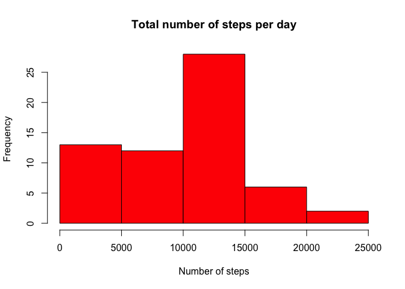
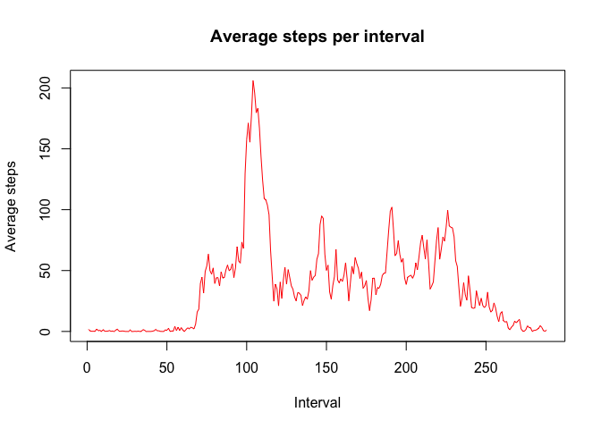
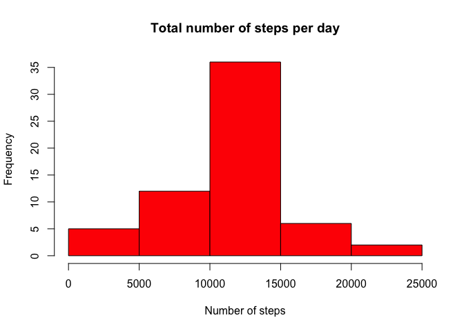
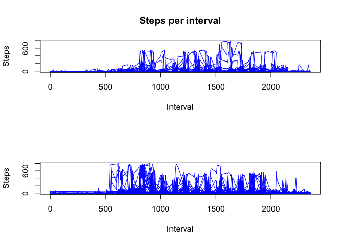

# Reproducible Research: Peer Assessment 1


## Loading and preprocessing the data

```r
step_data <- read.csv("activity.csv",  colClasses=c("numeric", "Date", "numeric"), na.strings="NA", header = TRUE, stringsAsFactors=FALSE)
steps_per_day <- tapply(step_data$steps, step_data$date, FUN=sum, na.rm=T)
```

## What is mean total number of steps taken per day?


```r
steps_mean <- mean(steps_per_day, na.rm = T)
steps_median <- median(steps_per_day, na.rm = T)
```

The mean total number of steps per day is 9354.2295082

The median total number of steps per day is 1.0395\times 10^{4}


```r
hist(steps_per_day, xlab="Number of steps", freq=T, col="red",  main= "Total number of steps per day")
```

 

## What is the average daily activity pattern?


```r
#avg_per_interval <- tapply(step_data$steps[step_data$steps>0], step_data$interval[step_data$steps>0], FUN=mean, na.rm=T)
avg_per_interval <- tapply(step_data$steps, step_data$interval, FUN=mean, na.rm=T)
plot(avg_per_interval, type="l", xlab="Interval",ylab="Average steps",main="Average steps per interval", col="red")
```

 

Which 5-minute interval, on average across all the days in the dataset, contains the maximum number of steps?


```r
max_steps=max(avg_per_interval)
max_steps_ival=names(avg_per_interval[avg_per_interval==max_steps])
```

Average across all days the interval 835 contains the most steps with 206.1698113 steps in the given 5 minute interval.

## Imputing missing values

```r
steps_filled <- step_data
for (idx in 1:nrow(steps_filled)) {
  if (is.na(steps_filled$steps[idx])) {
      steps_filled$steps[idx] <- avg_per_interval[toString(steps_filled$interval[idx])]
  }
}
steps_per_day_complete <- tapply(steps_filled$steps, steps_filled$date, FUN=sum, na.rm=T)
```

## What is mean total number of steps taken per day?
## Again

```r
steps_mean_complete <- mean(steps_per_day_complete, na.rm = T)
steps_median_complete <- median(steps_per_day_complete, na.rm = T)
```

The mean total number of steps per day is 1.0766189\times 10^{4}

The median total number of steps per day is 1.0766189\times 10^{4}


```r
hist(steps_per_day_complete, xlab="Number of steps", freq=T, col="red",  main= "Total number of steps per day")
```

 


## Are there differences in activity patterns between weekdays and weekends?

```r
suppressMessages(library(dplyr))

complete_steps<-as.data.frame(steps_filled)

#complete_steps<-mutate(complete_steps, day=weekdays(as.Date(rownames(complete_steps))), date=as.Date(rownames(complete_steps)))
complete_steps<-mutate(complete_steps, day=weekdays(as.Date(complete_steps$date)), date=as.Date(complete_steps$date))
#colnames(complete_steps) <- c("steps", "day", "date")


for (idx in 1:nrow(complete_steps)) {
  if (complete_steps$day[idx]=="Saturday" || complete_steps$day[idx]=="Sunday") {
      complete_steps$day[idx]<-"Weekend"
  }
  else{
        complete_steps$day[idx]<-"Weekday"
  }
}

complete_steps_grp<-group_by(complete_steps, date, interval)

par(mfrow=c(2,1))

plot(complete_steps_grp$interval[complete_steps_grp$day=="Weekend"], complete_steps_grp$steps[complete_steps_grp$day=="Weekend"], type="l", xlab="Interval",ylab="Steps",main="Steps per interval", col="blue")

plot(complete_steps_grp$interval[complete_steps_grp$day=="Weekday"], complete_steps_grp$steps[complete_steps_grp$day=="Weekday"], type="l", xlab="Interval",ylab="Steps", col="blue")
```

 


